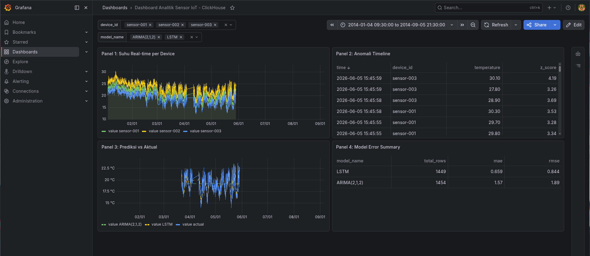
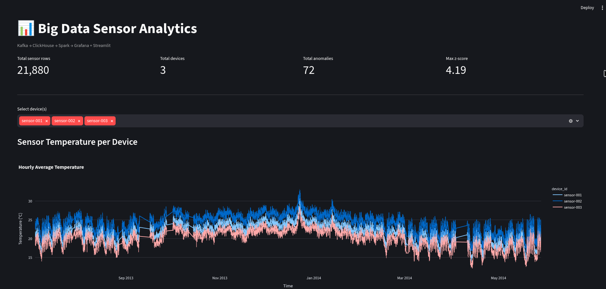

# Big Data Real-Time Streaming Local Lab

A local hands-on big data streaming and analytics lab using **Apache Kafka**, **ClickHouse**, **Apache Spark**, **Grafana**, and **Streamlit**.

This project simulates a real-time IoT sensor analytics pipeline on a single machine using Docker Compose. It covers streaming ingestion, batch ingestion, OLAP storage, Spark-based processing, anomaly detection, time-series forecasting, and dashboard visualization.

## Project Status

This repository implements a complete local baseline:

- Docker Compose infrastructure is running.
- Kafka ingestion is working.
- ClickHouse Kafka Engine ingestion is working.
- Batch ingestion from CSV is working.
- Spark can read and write ClickHouse data.
- Z-score anomaly detection results are stored in ClickHouse.
- ARIMA and LSTM forecasting results are stored in ClickHouse.
- Grafana dashboard is available.
- Streamlit dashboard is available.
- Architecture and demo documentation are included.

## Architecture

```text
CSV Historical Dataset
        │
        ├── Batch Ingestion
        │       └── Python → ClickHouse MergeTree
        │
        └── Streaming Simulation
                └── Python Producer → Kafka → ClickHouse Kafka Engine → Materialized View → MergeTree

ClickHouse
        │
        ├── Raw / historical sensor storage
        ├── Anomaly result storage
        ├── Forecast result storage
        └── Dashboard query layer

Spark
        │
        ├── Read sensor data from ClickHouse
        ├── Time-series aggregation
        ├── Sliding window analysis
        ├── Z-score anomaly detection
        └── Write anomaly results back to ClickHouse

Machine Learning
        │
        ├── ARIMA forecasting
        ├── LSTM forecasting
        ├── Model evaluation
        └── Write forecast results back to ClickHouse

Visualization
        │
        ├── Grafana dashboard
        └── Streamlit dashboard
```

For more detail, see:

- [`docs/system-architecture.md`](docs/system-architecture.md)
- [`docs/demo-checklist.md`](docs/demo-checklist.md)

## Tech Stack

| Layer                         | Technology                                  |
| ----------------------------- | ------------------------------------------- |
| Streaming ingestion           | Apache Kafka                                |
| OLAP storage                  | ClickHouse                                  |
| Stream-to-storage integration | ClickHouse Kafka Engine + Materialized View |
| Processing                    | Apache Spark / PySpark                      |
| Batch ingestion               | Python + Pandas + ClickHouse Connect        |
| Forecasting                   | ARIMA, LSTM                                 |
| Visualization                 | Grafana, Streamlit                          |
| Infrastructure                | Docker Compose                              |
| Local runtime                 | Python 3.11, Java 17                        |

## Main Features

### 1. Streaming Ingestion

A Python producer sends simulated sensor readings to Kafka.

```text
Python Producer → Kafka topic sensor-data → ClickHouse Kafka Engine → Materialized View → MergeTree
```

Kafka topic baseline:

```text
Topic: sensor-data
Partitions: 3
Replication factor: 1
```

### 2. Batch Ingestion

Historical CSV data is inserted directly into ClickHouse using Python.

```text
CSV dataset → Python batch ingestion → ClickHouse sensor_readings table
```

### 3. ClickHouse OLAP Storage

Main database objects:

```text
bigdata.sensor_kafka      Kafka Engine table
bigdata.sensor_mv         Materialized View
bigdata.sensor_readings   MergeTree table
bigdata.anomalies         MergeTree table
bigdata.forecasts         MergeTree table
bigdata.predictions       View for dashboard compatibility
```

### 4. Spark Processing

Implemented Spark jobs:

```text
spark_analysis.py              Read ClickHouse data with Spark
time_series_aggregation.py     Hourly aggregation
sliding_window_analysis.py     Sliding window analysis
anomaly_detection.py           Z-score anomaly detection
write_anomalies.py             Write anomalies back to ClickHouse
```

### 5. Time-Series Forecasting

Implemented ML scripts:

```text
ml_timeseries_prepare.py       Prepare hourly dataset from ClickHouse
feature_engineering.py         Generate lag, rolling, calendar, and diff features
arima_forecast.py              ARIMA forecasting
lstm_forecast.py               LSTM forecasting
evaluate_forecasts.py          Compare model performance
write_forecasts.py             Write forecast results to ClickHouse
```

Model comparison result:

```text
ARIMA(2,1,2): MAE 1.5657 | RMSE 1.8884 | MAPE 8.37%
LSTM        : MAE 0.6585 | RMSE 0.8444 | MAPE 3.47%
Best model  : LSTM
```

### 6. Visualization

Grafana dashboard panels:

```text
Panel 1: Sensor temperature per device
Panel 2: Anomaly timeline
Panel 3: Forecast vs actual
Panel 4: Model error summary
```

Streamlit dashboard sections:

```text
Summary metrics
Device selector
Sensor temperature chart
Anomaly table
Forecast model comparison
Forecast vs actual chart
```

## Screenshots

> Update the paths below if your screenshot filenames are different.

### Grafana Dashboard



### Streamlit Dashboard



## Project Structure

```text
bigdata-streaming-local-lab/
├── clickhouse/
│   ├── anomalies.sql
│   ├── basic_queries.sql
│   ├── direct_aggregation.sql
│   ├── forecasts.sql
│   ├── init.sql
│   └── predictions_view.sql
├── clickhouse-config/
│   └── network.xml
├── clickhouse-users/
│   └── default-user.xml
├── data/
│   ├── raw/
│   └── large/
├── docs/
│   ├── baseline-verification.md
│   ├── demo-checklist.md
│   ├── hdfs-dataset-upload.md
│   ├── system-architecture.md
│   ├── tensorflow-setup.md
│   └── images/
├── grafana/
│   └── dashboards/
├── ingestion/
│   └── batch_ingest.py
├── jars/
│   └── clickhouse-jdbc.jar
├── ml/
│   ├── arima_forecast.py
│   ├── evaluate_forecasts.py
│   ├── feature_engineering.py
│   ├── lstm_forecast.py
│   ├── ml_timeseries_prepare.py
│   └── write_forecasts.py
├── producer/
│   └── producer.py
├── scripts/
│   ├── apply-clickhouse-schema.sh
│   ├── create-kafka-topics.sh
│   └── use-java-17.sh
├── spark/
│   ├── anomaly_detection.py
│   ├── sliding_window_analysis.py
│   ├── spark_analysis.py
│   ├── time_series_aggregation.py
│   └── write_anomalies.py
├── streamlit/
│   └── app.py
├── docker-compose.yml
├── hadoop.env
├── requirements.txt
└── README.md
```

## Requirements

Recommended local environment:

```text
Docker and Docker Compose
Python 3.11
Java 17
At least 8 GB RAM
16 GB RAM recommended
```

This project was developed on Fedora Linux. Some environment-specific adaptations are included:

```text
Spark UI is mapped to localhost:8081 instead of localhost:8080
ClickHouse config bind mount uses SELinux relabeling (:ro,Z)
Java 17 helper script is included for PySpark
```

## Setup

### 1. Clone Repository

```bash
git clone https://github.com/Azzt17/bigdata-streaming-local-infrastructure/
cd bigdata-streaming-local-lab
```

### 2. Create Python Environment

```bash
python3.11 -m venv venv_bigdata
source venv_bigdata/bin/activate
pip install --upgrade pip setuptools wheel
pip install -r requirements.txt
```

### 3. Start Docker Compose Stack

```bash
docker compose up -d
docker compose ps
```

Expected services:

```text
namenode
datanode
spark-master
spark-worker
zookeeper
kafka
clickhouse
grafana
```

### 4. Apply ClickHouse Schema

```bash
scripts/apply-clickhouse-schema.sh
```

Or manually:

```bash
docker exec -i clickhouse clickhouse-client --multiquery < clickhouse/init.sql
docker exec -i clickhouse clickhouse-client --multiquery < clickhouse/anomalies.sql
docker exec -i clickhouse clickhouse-client --multiquery < clickhouse/forecasts.sql
docker exec -i clickhouse clickhouse-client --multiquery < clickhouse/predictions_view.sql
```

### 5. Create Kafka Topic

```bash
scripts/create-kafka-topics.sh
```

Verify:

```bash
docker exec kafka kafka-topics --describe   --topic sensor-data   --bootstrap-server localhost:9092
```

## Running the Pipeline

### 1. Run Streaming Producer

```bash
source venv_bigdata/bin/activate
python producer/producer.py --events 30 --interval 0.2
```

Verify data in ClickHouse:

```bash
docker exec -it clickhouse clickhouse-client --query "
SELECT
    count(),
    max(event_time)
FROM bigdata.sensor_readings;
"
```

### 2. Run Batch Ingestion

```bash
source venv_bigdata/bin/activate
python ingestion/batch_ingest.py
```

Verify:

```bash
docker exec -it clickhouse clickhouse-client --query "
SELECT
    count() AS total_rows,
    min(event_time) AS earliest_event,
    max(event_time) AS latest_event
FROM bigdata.sensor_readings;
"
```

Expected result:

```text
Total rows: around 21,880
```

### 3. Run Basic ClickHouse Queries

```bash
docker exec -i clickhouse clickhouse-client --multiquery < clickhouse/basic_queries.sql
```

### 4. Run Spark Jobs

Activate Java 17 and Python environment:

```bash
source scripts/use-java-17.sh
source venv_bigdata/bin/activate
```

Run Spark read test:

```bash
python spark/spark_analysis.py
```

Run time-series aggregation:

```bash
python spark/time_series_aggregation.py
```

Run sliding window analysis:

```bash
python spark/sliding_window_analysis.py
```

Run anomaly detection:

```bash
python spark/anomaly_detection.py
```

Write anomalies back to ClickHouse:

```bash
python spark/write_anomalies.py
```

Verify:

```bash
docker exec -it clickhouse clickhouse-client --query "
SELECT
    count() AS total_anomalies,
    min(event_time) AS earliest_anomaly,
    max(event_time) AS latest_anomaly
FROM bigdata.anomalies;
"
```

Expected result:

```text
Total anomalies: 72
```

### 5. Run Forecasting Pipeline

Prepare dataset:

```bash
python ml/ml_timeseries_prepare.py
```

Generate features:

```bash
python ml/feature_engineering.py
```

Run ARIMA:

```bash
python ml/arima_forecast.py
```

Run LSTM:

```bash
python ml/lstm_forecast.py --epochs 10
```

Compare models:

```bash
python ml/evaluate_forecasts.py
```

Write forecasts to ClickHouse:

```bash
python ml/write_forecasts.py
```

Verify:

```bash
docker exec -it clickhouse clickhouse-client --query "
SELECT
    model_name,
    count() AS total_rows,
    round(avg(absolute_error), 4) AS avg_absolute_error,
    min(forecast_time) AS earliest_forecast,
    max(forecast_time) AS latest_forecast
FROM bigdata.forecasts
GROUP BY model_name
ORDER BY avg_absolute_error;
"
```

## Dashboards

### Grafana

Open:

```text
http://localhost:3000
```

Login:

```text
Username: admin
Password: admin123
```

Dashboard:

```text
Dashboard Analitik Sensor IoT - ClickHouse
```

The exported dashboard JSON is stored under:

```text
grafana/dashboards/
```

### Streamlit

Run:

```bash
source venv_bigdata/bin/activate
streamlit run streamlit/app.py
```

Open:

```text
http://localhost:8501
```

## Key Results

### Data Volume

```text
Total sensor rows: 21,880
Total devices: 3
Total anomalies: 72
Max z-score: 4.19
```

### Forecasting Result

```text
LSTM performs better than ARIMA on this prepared hourly temperature dataset.

ARIMA(2,1,2)
MAE : 1.5657
RMSE: 1.8884
MAPE: 8.37%

LSTM
MAE : 0.6585
RMSE: 0.8444
MAPE: 3.47%
```

## Design Notes

This project is intentionally built as a **single-machine local lab**, not as a production-grade distributed system.

Important design decisions:

- Use Docker Compose instead of Kubernetes for local simplicity.
- Use ClickHouse Kafka Engine for direct stream ingestion.
- Use Spark for processing and anomaly detection, not for simple dashboard queries.
- Use ClickHouse SQL for fast OLAP aggregation.
- Use Grafana for operational visualization.
- Use Streamlit for exploratory visualization.
- Keep generated outputs and raw datasets out of Git.

## Limitations

Current limitations:

```text
Kafka uses a single broker baseline.
Replication factor is 1.
No schema registry.
No production-grade authentication or secrets management.
No orchestration layer such as Airflow or Dagster.
No cloud deployment yet.
No automated integration test suite yet.
```

## Future Improvements

Potential next steps:

```text
Upgrade Kafka to 3 brokers with replication factor 3
Add Kafka UI
Add Prometheus and JMX exporter
Add ClickHouse/Grafana provisioning automation
Add CI checks for Python scripts
Add Makefile for common commands
Add Dockerized Streamlit service
Add cloud deployment using DigitalOcean, AWS, or Azure
Add benchmark scripts for throughput and latency
Add fault-tolerance test documentation
```

## Useful Commands

Stop infrastructure:

```bash
docker compose down
```

Stop and remove volumes:

```bash
docker compose down -v
```

Use `-v` only when a full reset is intended.

Check Docker services:

```bash
docker compose ps
```

Check ClickHouse tables:

```bash
docker exec -it clickhouse clickhouse-client --query "
SELECT
    name,
    engine
FROM system.tables
WHERE database = 'bigdata'
ORDER BY name;
"
```

Check Kafka topic:

```bash
docker exec kafka kafka-topics --describe   --topic sensor-data   --bootstrap-server localhost:9092
```

## Documentation

Additional documentation:

- [`docs/system-architecture.md`](docs/system-architecture.md)
- [`docs/demo-checklist.md`](docs/demo-checklist.md)
- [`docs/baseline-verification.md`](docs/baseline-verification.md)
- [`docs/hdfs-dataset-upload.md`](docs/hdfs-dataset-upload.md)
- [`docs/tensorflow-setup.md`](docs/tensorflow-setup.md)

## License

This repository is intended for academic and portfolio purposes. Add a license file if this project will be distributed or reused publicly.
